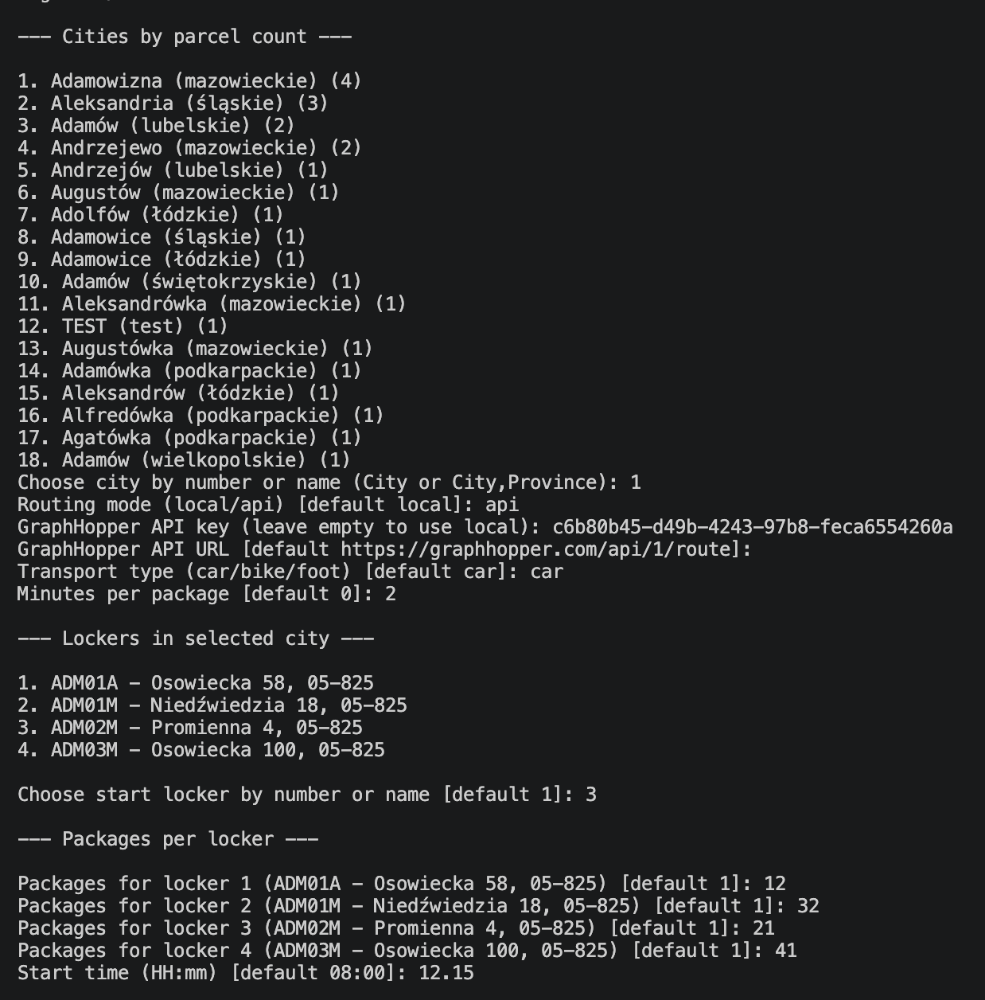
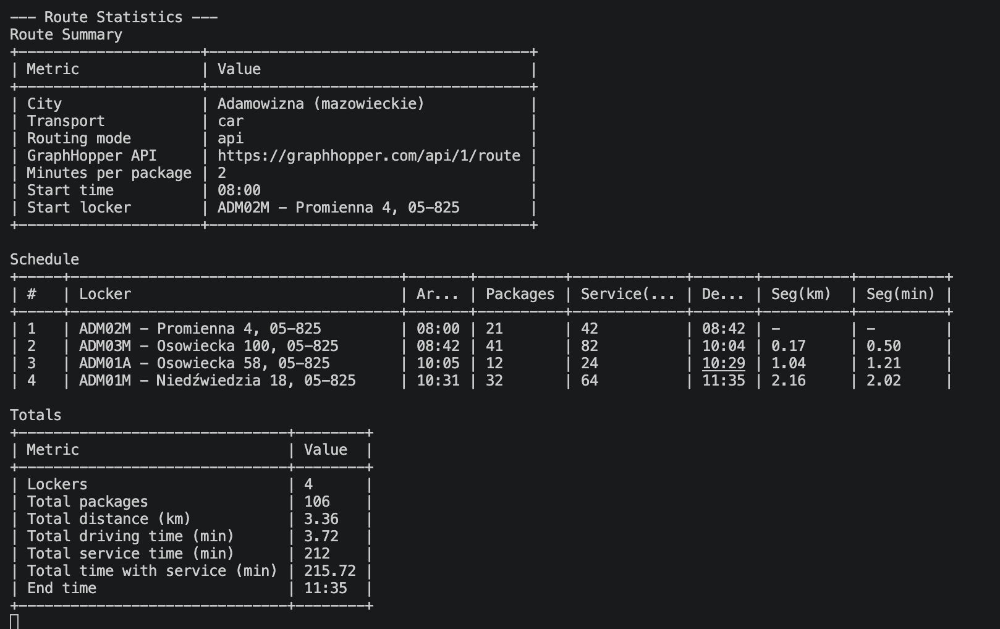

# Courier Help Inpost

## Description

**Courier Help Inpost** is a route optimization application designed for fast and efficient package delivery planning. The system retrieves a list of all available lockers from the InPost locker API and organizes them by city and province. Users can select a city, configure delivery parameters, and the application automatically calculates the optimal delivery route using the GraphHopper routing engine.

### Key Capabilities

- Select destination city and province
- Configure delivery parameters (starting parcel, packages per locker, time per package)
- Automatic route optimization with estimated delivery time and distance
- Support for both local and cloud-based routing calculations
- Spring Boot web application running on port 9090

## Features

- Intelligent route optimization using GraphHopper
- Real-time city and parcel count statistics
- Flexible routing modes (local or API-based)
- Accurate delivery time and distance prediction
- InPost locker network integration

## Prerequisites

Before launching this project, ensure you have:

- **Java 17** or higher
- **Maven 3.6+**
- (Optional) GraphHopper API key for online mode
- (Optional) Poland OSM data file for local mode

## Installation

1. Clone the repository:
```bash
git clone <repository-url>
cd Courier_Help_Inpost
```

2. Install dependencies:
```bash
mvn clean install
```

## Configuration

The application supports two routing modes:

### Mode 1: Online Routing (GraphHopper API)

**Pros:** Fast, no preprocessing required
**Cons:** Requires internet connection and API key

- Obtain a free GraphHopper API key from [https://graphhopper.com](https://graphhopper.com)
- When prompted during execution, enter your API key
- Set the API URL (default: `https://graphhopper.com/api/1/route`)

### Mode 2: Local Routing

**Pros:** No internet dependency, fully offline
**Cons:** Slower initial startup (preprocessing time), requires OSM data file

- Download Poland OSM data file: `poland-260430.osm.pbf`
- Place it in the `lib/` folder at project root
- Select "local" when prompted for routing mode
- Initial run will process the map data (may take several minutes); subsequent runs will be fast

**Example OSM file location:**
```
Courier_Help_Inpost/
├── lib/
│   └── poland-260430.osm.pbf
├── pom.xml
└── ...
```



## Launch Instructions

### Development Mode

To start the application:

```bash
mvn clean spring-boot:run
```

The application will:
1. Fetch the latest InPost locker data
2. Display cities ranked by parcel count
3. Prompt you to select a city
4. Ask for routing mode preference (local or api)
5. Calculate and display the optimized route

### Usage

After running `mvn clean spring-boot:run`:

1. **Select a city**: Enter city number or name (with optional province)
   - Example: `1` or `Adamowizna,mazowieckie`

2. **Choose routing mode**: Select `local` or `api`

3. **Configure route parameters**:
   - Starting parcel number
   - Packages per locker
   - Time per package (in seconds)
   - Delivery start time

4. **View results**: The application calculates and displays:
   - Total distance (kilometers)
   - Estimated delivery time
   - Complete route through all lockers



